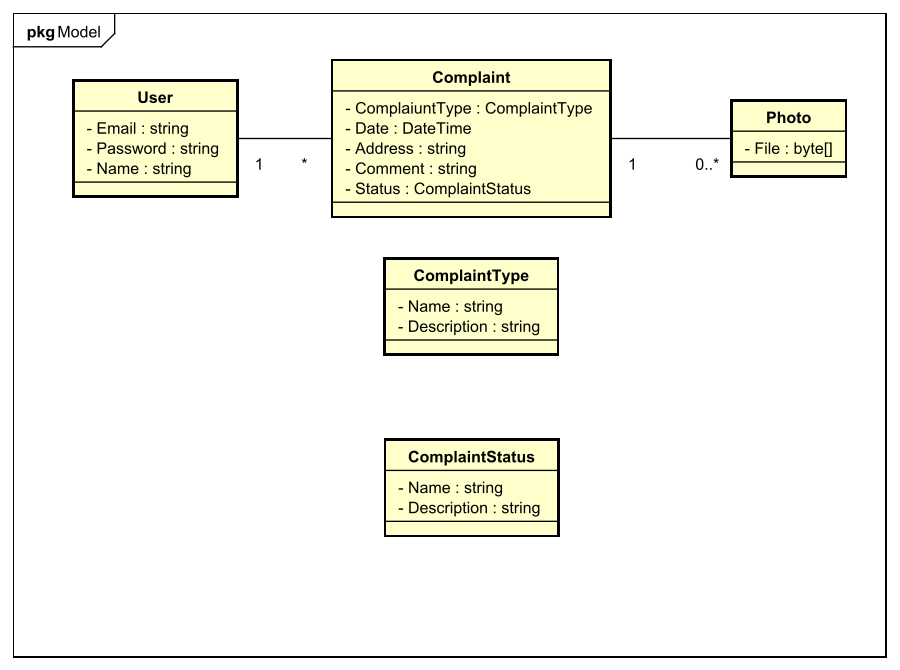

# Caminhos Dourados

Time criado para participar do [Hackton Haks for Change](https://www.hackforchange.com.br/?utm_source=akna&utm_medium=email&utm_campaign=INST-230920-Hack-for-change) realizado pela [Alura](https://www.alura.com.br/) e [Fiap](https://www.fiap.com.br/) em Parceria com a [Passos Mágicos](https://passosmagicos.org.br/)

## Integrantes

* [Felipe Luís Pinheiro](https://www.github.com/flpinheiro) 
* [Samuel Guerra](https://github.com/SamG1002) 
* [Emile Maia](https://github.com/Emii2003) 
* [Kamila Vieira](https://github.com/Kamila-Vieira) 
* [Beatriz Cristina Costa](https://github.com/BeaCristin) 

## A Solução

Abaixo vemos o diagrama da modelagem básica.

## Repositórios

 * [Back-end]()
 * [Front-End](https://github.com/GoldenPaths/caminhos-dourados-frontend)

## Stack

* Back-end

    
    

* Front-end

    
    

* Database

    
