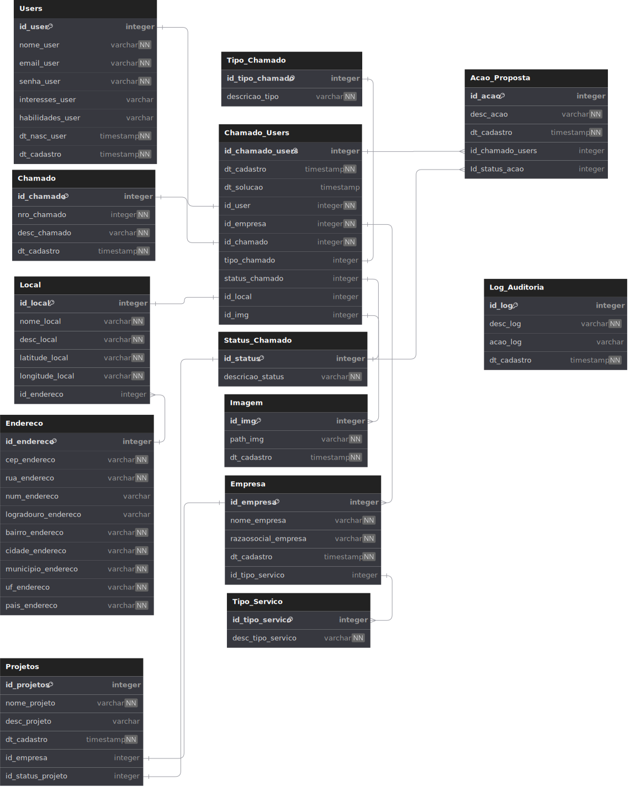
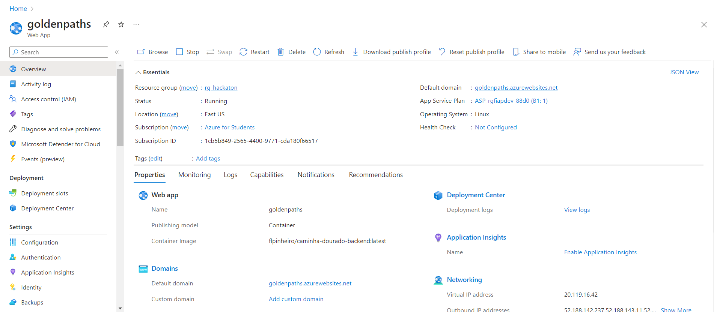

# Caminhos Dourados

Time criado para participar do [Hackton Hacks for Change](https://www.hackforchange.com.br/?utm_source=akna&utm_medium=email&utm_campaign=INST-230920-Hack-for-change) realizado pela [Alura](https://www.alura.com.br/) + [Fiap](https://www.fiap.com.br/) em Parceria com a [Passos Mágicos](https://passosmagicos.org.br/)

## Integrantes

* [Felipe Luís Pinheiro](https://www.github.com/flpinheiro) 
* [Samuel Guerra](https://github.com/SamG1002) 
* [Emile Maia](https://github.com/Emii2003) 
* [Kamila Vieira](https://github.com/Kamila-Vieira) 
* [Beatriz Cristina Costa](https://github.com/BeaCristin) 

## A Solução

* [Aplicativo Caminhos Dourados](https://caminhos-dourados-frontend.vercel.app/)

O objetivo primordial do projeto inovador é criar um ambiente de participação cidadã e 
colaboração ativa entre os moradores de comunidades e apoiar pequenas empresas locais, 
visando  empoderar os moradores, oferecendo-lhes uma voz direta na melhoria das condições 
de suas próprias comunidades e ao mesmo tempo em que oferece oportunidades educacionais 
práticas para os alunos da instituição Passos Mágicos e engajamento para as empresas.

## Prototipação e Modelagem

*    Podemos ver abaixo a estrutura relacional em nosso modelo lógico.

*    Também fizemos um Prototipo no figma no qual modelamos como nossas telas ganharão vida:
()
[Link de visualização do Figma](https://www.figma.com/file/apJwJTP7yu2M2G0ndZSjmm/Projeto?type=design&node-id=0%3A1&mode=design&t=l1pvgBHJ4PZOyRXY-1)

## Hospedagem
Foram feitas as hospedagens da seguinte maneira:

*    O Banco de Dados foi publicado na nuvem Azure como um Database Server como mostrado abaixo:
     

*    Já nossa API feita em C#, hospedamos em um Web App do Azure como ilustrado:
     

*   E para complemetar nosso lindissimo Front-end foi hospedado utilizando o Vercel:
     [Aplicativo Caminhos Dourados](https://caminhos-dourados-frontend.vercel.app/)

     
## Repositórios

 * [Back-end](https://github.com/GoldenPaths/caminhos-dourados-backend)
 * [Front-End](https://github.com/GoldenPaths/caminhos-dourados-frontend)

## Stack

* Back-end

    
    

* Front-end

    
    

* Database

    
